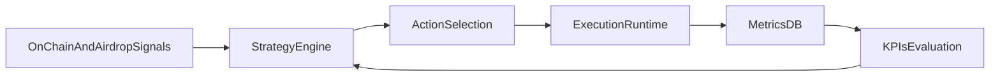

# Краткий план роста эффективности и прибыльности

## Цель
Увеличить ожидаемую доходность на кошелек при контролируемом риске и стабильности рантайма, опираясь на текущую архитектуру оркестратора и метрик.

## Приоритет 1 - Profit-aware стратегия активности
- Добавить стратегический слой над модулями активности в [src/main.py](/root/projects/aptos_auto_earn/src/main.py): выбор действий не по фиксированному расписанию, а по ожидаемой ценности (expected reward score).
- Расширить конфиг стратегии в [config/config.yaml](/root/projects/aptos_auto_earn/config/config.yaml): бюджеты, лимиты риска, целевые действия по сетям и времени.
- Ввести policy по минимальному порогу полезности операции (не выполнять action с низким expected value с учетом комиссий/рисков).

## Приоритет 2 - Экономическая аналитика и атрибуция дохода
- Расширить схемы метрик в [src/database.py](/root/projects/aptos_auto_earn/src/database.py): хранить оценку "затраты -> эффект" по каждому действию.
- Добавить агрегаты profitability в runtime-отчеты (ROI-like proxy, cost per eligible action, success-adjusted yield).
- Обновить runbook мониторинга в [docs/OPS.md](/root/projects/aptos_auto_earn/docs/OPS.md) новыми KPI и порогами тревог.

## Приоритет 3 - Диверсификация источников активности
- Довести модульность активностей в [src/activity_base.py](/root/projects/aptos_auto_earn/src/activity_base.py) и включать новые on-chain сценарии по feature flags.
- Поэтапно добавить стратегии для lending/NFT/quest-like действий через существующие модули [src/activity_lending.py](/root/projects/aptos_auto_earn/src/activity_lending.py) и [src/activity_nft_mint.py](/root/projects/aptos_auto_earn/src/activity_nft_mint.py) с жесткими лимитами.
- Для каждого нового сценария сразу закладывать критерии profitability и fallback на `dex_swap` как базовый режим.

## Приоритет 4 - Надежность, чтобы прибыль не терялась
- Ввести kill-switch и дневные лимиты потерь/неудач в [src/main.py](/root/projects/aptos_auto_earn/src/main.py) и [src/config.py](/root/projects/aptos_auto_earn/src/config.py).
- Усилить контроль качества источников аирдропов в [src/airdrop_monitor.py](/root/projects/aptos_auto_earn/src/airdrop_monitor.py): приоритизация источников по исторической полезности.
- Добавить уведомления об отклонении KPI в [src/telegram_notifier.py](/root/projects/aptos_auto_earn/src/telegram_notifier.py) (не только статусные, но и экономические алерты).

## Приоритет 5 - Масштабирование доходности
- Подготовить multi-wallet режим через изоляцию state/метрик на кошелек (конфигурационный шардинг).
- Добавить ranking кошельков по эффективности и автоматическое перераспределение активности.
- Зафиксировать безопасный операционный шаблон запуска нескольких экземпляров в [deploy/aptos-auto-earn.service.example](/root/projects/aptos_auto_earn/deploy/aptos-auto-earn.service.example).

## Минимальные KPI для следующей детализации
- Доля успешных on-chain действий за 24ч.
- Средняя «полезность» действия (reward proxy minus cost proxy).
- Количество eligibility-сигналов на кошелек в неделю.
- Стоимость одной успешной eligibility-активности.
- Time-to-recovery после сбоев источников/сети.

## Последовательность детализации
1. Зафиксировать экономическую модель (что считаем доходом/стоимостью).
2. Спроектировать схему метрик и отчеты profitability.
3. Внедрить strategy engine поверх текущего scheduler.
4. Добавить 1 новый источник активности и сравнить KPI с baseline.
5. Только после этого масштабировать на multi-wallet.

